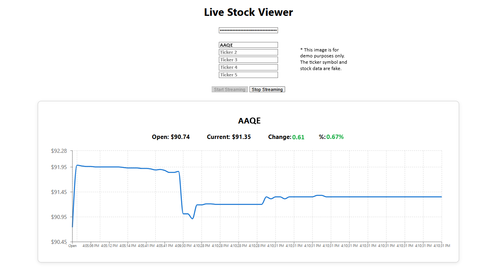

## 📈 StockApp

A full-stack stock market dashboard demo built with a C#.NET (Web API and SignalR) backend and a React frontend. It streams and charts real-time stock prices using the free Finnhub API.

The application allows users to monitor up to **5 stock symbols simultaneously**, displaying:

* Opening price
* Current live price when streaming starts
* Dollar gain/loss
* Percentage gain/loss
* Real-time intraday chart updates

Live market data is streamed through **Finnhub WebSockets**, relayed through an ASP.NET Core backend using **SignalR**, and visualized in React using **Recharts**.

------------------------------
## 📸 User Interface Preview

## Ticker Symbol Entry Form and First Result

------------------------------
## Demo Features

✅ Monitor up to 5 stock symbols at once<br/>
✅ Real-time price streaming via Finnhub WebSocket API<br/>
✅ SignalR-powered real-time updates<br/>
✅ Live intraday stock charting without page refresh<br/>
✅ Responsive chart visualization<br/>
✅ Opening vs latest price comparison<br/>
✅ Automatic gain/loss calculations<br/>
✅ Percentage change calculations<br/>
✅ Invalid ticker handling and error reporting<br/>
---------------------------
## ⚙️ Local Development Setup / Quick Start

Get StockApp running in just a few minutes.

### Prerequisites

* .NET SDK 9.0 (or compatible version)
* Node.js 18+
* npm
* A free Finnhub API key

### 1. Get a Free Finnhub API Key

This application requires a Finnhub API key for both quote retrieval and real-time streaming.

To sign up for a free Finnhub account and create a free API key, visit:

https://finnhub.io/register

After verifying your email:

1. Log in to the Finnhub Dashboard
2. Locate your API Key (also called a Token)
3. Copy the API Key
4. Paste it into the application when prompted

### 2. Start the Backend

```bash
cd StockApp-Backend
dotnet restore
dotnet run
```

Backend URLs:

```text
https://localhost:7203
http://localhost:5032
```

SignalR Hub:

```text
https://localhost:7203/stockhub
```

### 3. Start the Frontend

```bash
cd stockapp-frontend
npm install
npm start
```

Frontend URL:

```text
http://localhost:3000
```

### 4. Stream Live Stock Data

1. Open the React application
2. Enter your Finnhub API Key
3. Enter up to 5 stock symbols

Example:

```text
AAPL
MSFT
NVDA
AMZN
TSLA
```

4. Click **Start Streaming**
5. View real-time stock prices and intraday charts
6. Click **Stop Streaming** when finished
---------------------------
## 🛠️ Tech Stack

### Frontend

* React
* Axios
* SignalR JavaScript Client
* Recharts

### Backend

* ASP.NET Core (.NET)
* SignalR
* WebSockets
* HttpClient
* Newtonsoft.Json

### Market Data

* Finnhub REST API
* Finnhub WebSocket API
---------------------------
## 📂 Project Architecture Overview

```text
+-------------------+
|    React UI       |
|   (Recharts)      |
+---------+---------+
          |
          | SignalR
          v
+-------------------+
| ASP.NET Core API  |
|   + SignalR Hub   |
+---------+---------+
          |
          | WebSocket
          v
+-------------------+
|     Finnhub       |
| Real-Time Market  |
|      Data API     |
+-------------------+
```

```text
StockApp
│
├── StockApp-Backend
│   ├── Controllers
│   ├── Hubs
│   ├── Models
│   ├── Services
│   └── Program.cs
│
└── stockapp-frontend
    ├── src
    ├── public
    └── package.json
```
---------------------------
# Getting a Free Finnhub API Key

This application requires a Finnhub API key.

To sign up for a free Finnhub account and create a free API key, visit:

https://finnhub.io/register

After verifying your email:

1. Log in to the Finnhub Dashboard
2. Locate your API Key (also called a Token)
3. Copy the API Key
4. Paste it into the application when prompted

The free Finnhub tier is sufficient for running this application.

---------------------------
# Backend Setup

## Requirements

* .NET 9 SDK (or compatible version)
* Visual Studio 2022+ or VS Code

## Run the Backend

Navigate to:

```bash
cd StockApp-Backend
```

Restore packages:

```bash
dotnet restore
```

Run the API:

```bash
dotnet run
```

Default URLs:

```text
https://localhost:7203
http://localhost:5032
```

SignalR Hub:

```text
https://localhost:7203/stockhub
```

---------------------------
# Frontend Setup

## Requirements

* Node.js 18+
* npm

Navigate to:

```bash
cd stockapp-frontend
```

Install dependencies:

```bash
npm install
```

Run React:

```bash
npm start
```

The frontend launches at:

```text
http://localhost:3000
```
---------------------------
# Using the Application

1. Launch the backend
2. Launch the frontend
3. Enter your Finnhub API Key
4. Enter 1–5 stock symbols

Examples:

```text
AAPL
MSFT
NVDA
AMZN
TSLA
```

5. Click **Start Streaming**
6. Watch live stock prices update in real time
7. Click **Stop Streaming** to end the stream
---------------------------
# API Endpoints

## Start Streaming

```http
POST /api/stock/start-stream
```

Request:

```json
{
  "apiKey": "YOUR_FINNHUB_API_KEY",
  "tickers": [
    "AAQE"
  ]
}
```

Response:

```json
[
  {
    "ticker": "AAQE",
    "openingPrice": 91.75,
    "currentPrice": 101.89,
    "change": 10.14,
    "changePercentage": 11.05
  }
]
```

## Stop Streaming

```http
POST /api/stock/stop-stream
```

Response:

```http
200 OK
```
---------------------------
# SignalR Events

## StockUpdate

The backend broadcasts stock updates using SignalR after an update to the price was received from Finnhub.

Note: It is possible for multiple trades to come through that are recorded with the same date/time, as streamed by Finnhub.

---------------------------
# Error Handling

The application gracefully handles:

* Invalid stock symbols
* Missing quote data
* Finnhub API failures
* WebSocket disconnects
* SignalR reconnections
* API exceptions

Example response:

```json
{
  "ticker": "INVALID",
  "isValid": false,
  "error": "Ticker not found"
}
```
---------------------------
# Future Enhancements

Ideas for extending the project:

* Historical charting
* Market news integration
* Company profiles
* Watchlists
* User authentication
* Dark mode
* Portfolio tracking
* Price alerts
* Docker support
* Azure deployment
---------------------------
# Disclaimer

Stock information is provided by Finnhub and is intended for informational and educational purposes only.

This application is a software demonstration and should not be used as the sole basis for investment decisions, financial advice, or securities trading.

Users are responsible for complying with all applicable Finnhub terms of service, stock market regulations, and financial trading requirements.

#### The author assumes no liability of any kind and does not endorse any stock or financial service.
---------------------------
# License

MIT License

Feel free to use, modify, and distribute this project.
